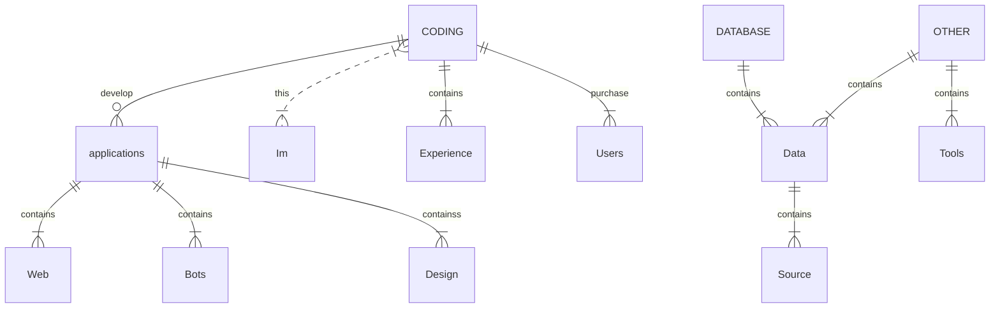

<p align="center">
  
</p>

[](https://git.io/typing-svg)

<h1 align="center">
  <b>Rebellionaurora'apollonia#5644</b>
</h1>

<p align="center">
  <b>Some Links:</b><br>
  <a href="https://vk.com/">Coming soon.</a> |
  <a href="https://discord.com/users/867726711578689536">Дискорд</a> |
  <a href="https://rebellionauroraapollonia.netlify.app">Веб-сайт</a>
  <br><br>
</p>

## Hello there! I am a self-taught programmer. I like to write bots for discord and telegram, develop websites and web applications. I've been developing for a year now. I'm learning Python, C# and JavaScript.


[](https://discord.com/users/867726711578689536)

<br clear="left"/>
<br>

# My E-mail : rebellionauroraapollonia@gmail.com



<p align="center">
  
</p>

# Languages and Tools


[](https://github.com/anuraghazra/github-readme-stats)

```python
class Rebellionauroraapollonia():
    
  def __init__(self):
    self.website = "https://Rebellionauroraapollonia.netlify.app"
    self.username = "Rebellionaurora'apollonia"
    self.location = "Russian Federation, Moskow"
    self.discord = "Rebellionaurora'apollonia#5644"
    self.telegram = "Rebellionauroraapollonia"

  def __str__(self):
    return self.name

if __name__ == '__main__':
    me = Rebellionauroraapollonia()
```

#                

```python
___███████▀◢▆▅▃ 　　　   　　 　　　 ▀▀████ONII CHAN
___██████▌◢▀█▓▓█◣   　　　　　　▂▃▃　 ████onii chan
__▐▐█████▍▌▐▓▓▉　　　　　　　◢▓▓█ ▼ ████ONII CHAN
__ ▌██████▎　 ▀▀▀　　　　　　 　█▓▓▌ ▌ █████▌onii chan
_▐ ██████▊　 ℳ 　　　　　　　　▀◥◤▀    ▲████▉ONII CHAN
_▊ ███████◣ 　　　　　　  ′　　　ℳ　 ▃◢██████▐onii chan
_ ▉ ████████◣ 　　　　 ▃、　　　　　◢███▊███ ONII CHAN
_▉　 █████████▆▃　　　　　　　 ◢████▌ ███  onii chan
_ ▉　 ████▋████▉▀◥▅▃▃▅▇███▐██▋　▐██ONII CHAN
```

```python
殪幢緻Iii爰曷樔黎㌢´　　｀ⅷ
艇艀裲f睚鳫巓襴骸　　　　  贒憊
殪幢緻I翰儂樔黎夢'”　 　 ,ｨ傾
盥皋袍i耘蚌紕偸′　　　 雫寬I
悗f篝嚠篩i縒縡齢　　 　 Ⅷ辨f
輯駲f迯瓲i軌帶′　　　　　`守I厖孩
幢儂儼巓襴緲′　 　 　 　 　 `守枢i磬廛
嚠篩I縒縡夢'´　　　 　 　 　 　 　 `守峽f
蚌紕襴緲′　　　　　　　　　　　　　‘守畝
f瓲軌揄′　　　　　　　　　　　　　,gf毯綴
鳫襴鑿　　　　　　　　　　 　 　 奪寔f厦
絨緲′　　　　　　 　 　 　 　　　　 　 ”'罨悳
巓緲′　　　　　　 　 　 　 　 　 　 綴〟 ”'罨椁
巓登嶮 薤篝㎜㎜ g　 　 緲　 　 甯體i爺綴｡, ”'罨琥
I軌襴暹 甯幗緲fi'　　 緲',纜　　贒i綟碕碚爺綴｡ ”'罨皴
巓襴驫 霤I緲緲　　 纜穐　　甯絛跨飩i髢綴馳爺綴｡`'等誄
```

[](https://spotify-github-profile.vercel.app/api/view?uid=31hdishdd3dvlc3z7zfqkpahshra&redirect=true)
